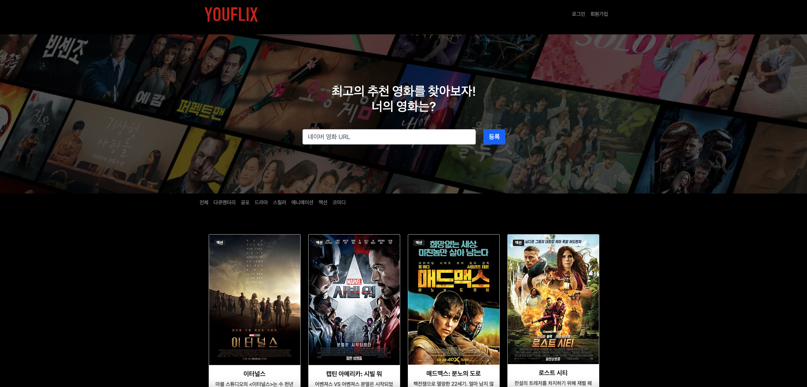

---
#### 항해99 7기 A반 2조 - 미니프로젝트1  
# YOUFLIX - 너의 영화는?  
---

---
## 1. 프로젝트 소개

항해99를 시작하기 전에 만들었던 "스파르타피디아"에 새로 배운 기능들을 입혔습니다.  
Jinja2 템플릿을 활용하여 서버사이드렌더링을 적용해보고, JWT로 로그인 기능도 구현했습니다.  
Bootstrap을 "적극" 활용한 CSS는 덤입니다.  
친구들과 최고의 추천 영화를 기록하고, 각자의 리뷰를 남겨봅시다.  

## 2. 팀 소개
- 기현준(팀장): 1) 로그인, 회원가입 페이지 작성, 2) JWT 로그인 방식 구현  
- 고백재: 1) 메인, 상세 페이지 작성, 2) CSS Container 적용  
- 곽동관: 1) 로그인, 회원가입 페이지 작성, 2) JWT 로그인 방식 구현  
- 조한울: 1) 메인, 상세 페이지 작성, 2) 페이지 구조 설계  

## 3. 작업 기간
- 2022년 5월 9일 ~ 2022년 5월 12일 (총 4일)

## 4. 사용 기술
`Back-end`  
- Python
- Flask
- MongoDB
- BS4
- JWT

`Front-end`
- JQuery
- Bootstrap
- Jinja2

## 5. 구현 기능
+ 메인 페이지  
  : 네이버 영화 URL 등록  
  : 등록된 URL로 네이버 영화 크롤링(장르, 포스터, 제목, 설명)  
  : DB에 저장된 영화 카드 형식으로 리스트업  
  : 장르별로 영화 필터링  
  : 로그인 및 회원가입 페이지 리디렉션  

+ 상세 페이지  
  : 리뷰 등록(영화ID, 작성자, 리뷰)  
  : DB에 저장된 리뷰 리스트업  

+ 로그인 페이지  
  : 비밀번호 해시값 확인 및 토큰 부여  

+ 회원가입 페이지  
  : 아이디 중복 확인  
  : 아이디, 비밀번호 양식 확인  
  : 비밀번호 일치 확인  
  : 회원정보 등록(아이디, 비밀번호 해시값)  

## 6. Troubleshooting  
- 영화 장르 필터링 시 app.py상의 url과 사용되는 변수값이 중복되어 오류  
  : url 변경하여 해결  
- Ajax 콜이 성공한 후에 비동기식 처리 방식으로 인해 Ajax 내부 함수 실행 전에 다른 페이지로 넘어가는 오류  
  : Ajax에 "async: false" 추가로 동기식 처리방식을 적용하여 해결  
- Python, HTML, CSS에 익숙하지 않아 발생한 수많은 오류  
  : Google로 해결  
---
